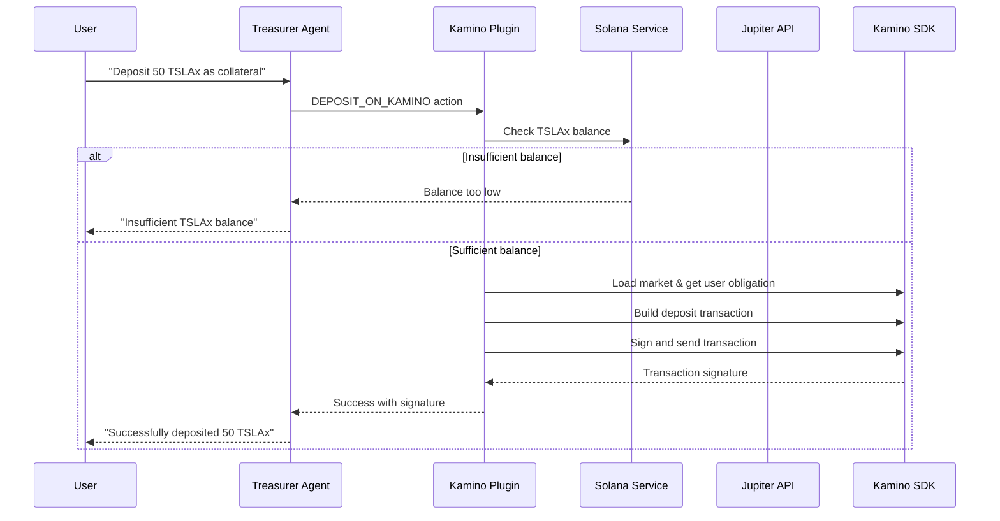

# Kamino Tesla xStock Integration Plan

## Current State Analysis

The Kamino plugin exists but has critical implementation gaps that prevent it from working with Tesla xStock or any tokens:

**What's Working:**

- Tesla xStock mint address is correctly configured in `[plugin-kamino/src/constants.ts](plugin-kamino/src/constants.ts)`
- Token symbol recognition and mint resolution logic is implemented
- Jupiter swap integration for acquiring Tesla xStock works
- Plugin structure follows ElizaOS patterns correctly

**Critical Issues:**

- Transaction execution is incomplete - returns `"tx_signature_placeholder"` instead of sending transactions
- Obligation account handling uses hardcoded wrapper instead of fetching user's actual obligation
- No balance checking before transactions
- Plugin is not integrated into any character configuration
- Missing owner parameter in SDK calls

## Implementation Strategy

### Phase 1: Fix Core Transaction Execution

**Fix Transaction Execution in Lending Actions**

The `[executeKaminoAction](plugin-kamino/src/actions/lending.ts#L12-L105)` function needs complete rewrite to:

- Fetch user's actual obligation account via `market.getAllUserObligations(wallet.publicKey)`
- Pass wallet public key as owner parameter to SDK methods
- Execute transactions using the imported `sendTransactionFromAction` utility
- Return actual transaction signatures

**Add Balance Checking Capability**

Create new action to check Tesla xStock balance before transactions:

- Integrate with existing `[SolanaService.getTokenBalance()](plugin-solana/src/services/solanaService.ts#L73)` method
- Add balance validation to deposit/borrow actions
- Provide clear error messages for insufficient balances

### Phase 2: Enhance Plugin Functionality

**Improve Token Handling**

- Add decimal precision handling for Tesla xStock (likely 6 decimals like other SPL tokens)
- Add minimum deposit/borrow amount validation
- Implement LTV ratio checking before borrow operations

**Add Comprehensive Error Handling**

- Specific error messages for insufficient collateral
- Network connectivity error handling
- SDK version compatibility checks

### Phase 3: Character Integration

**Integrate with Treasurer Character**

Add Kamino plugin to `[src/characters/treasurer.ts](src/characters/treasurer.ts)`:

- Add `kaminoPlugin` to plugins array
- Add Solana plugin for balance checking
- Update bio and system prompt to include Kamino lending capabilities
- Add Tesla xStock lending to topics and message examples

**Environment Configuration**

- Tesla xStock mint is already configured correctly
- Solana RPC and private key are configured in `[.env](.env)`
- No additional environment setup needed

### Phase 4: Testing and Validation

**Create Test Scenarios**

1. Check Tesla xStock balance
2. Acquire Tesla xStock via Jupiter swap
3. Deposit Tesla xStock as collateral
4. Borrow USDC against Tesla xStock
5. Execute yield loop with Tesla xStock

**Integration Testing**

- Test agent discovery of Kamino actions
- Verify natural language processing matches user intents
- Test error handling and user feedback

## Technical Implementation Details

### Key Files to Modify

1. `**[plugin-kamino/src/actions/lending.ts](plugin-kamino/src/actions/lending.ts)**`
  - Complete `executeKaminoAction` function implementation
  - Add proper obligation account fetching
  - Implement transaction execution
2. `**[plugin-kamino/src/index.ts](plugin-kamino/src/index.ts)**`
  - Add balance checking action
  - Export new action in plugin definition
3. `**[src/characters/treasurer.ts](src/characters/treasurer.ts)**`
  - Add Kamino and Solana plugins
  - Update character description and examples

### Transaction Flow for Tesla xStock Collateral




### SDK Integration Pattern

```typescript
// Fixed executeKaminoAction implementation
async function executeKaminoAction(
    runtime: IAgentRuntime,
    actionType: "deposit" | "borrow",
    amount: number,
    tokenSymbol: string,
    mintAddress?: string
) {
    // 1. Load market and fetch user's actual obligation
    const obligations = await market.getAllUserObligations(wallet.publicKey);
    const obligation = obligations[0] || await createNewObligation(market, wallet);
    
    // 2. Build transaction with proper parameters
    const action = await KaminoAction.buildDepositTxns(
        market,
        amount.toString(),
        new PublicKey(tokenMint),
        obligation,
        wallet.publicKey // Add owner parameter
    );
    
    // 3. Execute transaction
    const signature = await sendTransactionFromAction(
        connection,
        action,
        wallet
    );
    
    return signature;
}
```

## Success Criteria

- Tesla xStock balance checking works
- Tesla xStock can be deposited as collateral
- USDC can be borrowed against Tesla xStock collateral
- Yield looping with Tesla xStock functions end-to-end
- Treasurer agent can discover and use all Kamino actions
- Error handling provides clear feedback to users
- All transactions return actual signatures, not placeholders

## Risk Mitigation

- Test with small amounts on mainnet first
- Implement comprehensive error handling
- Add transaction simulation before execution
- Use existing Solana service for balance validation
- Leverage proven Jupiter integration for token acquisition

